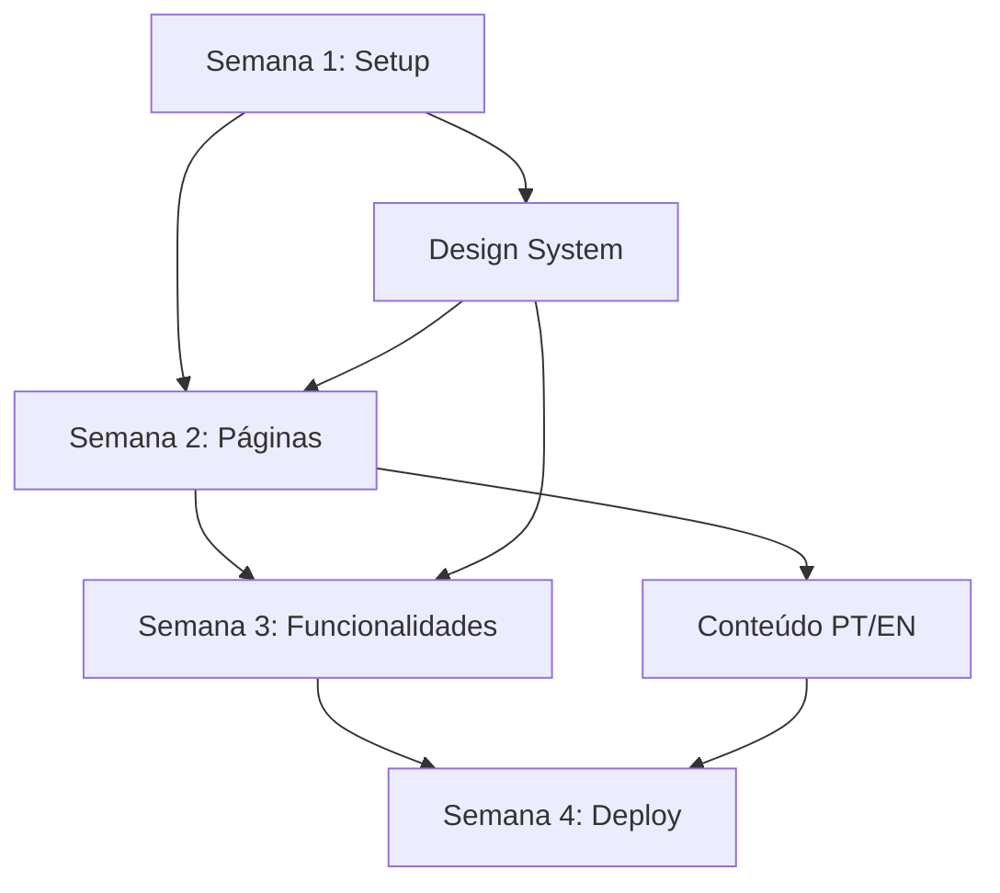

# 🚀 J2 Tech Solutions - Planejamento Completo do Projeto

**Data de Criação:** 14 de Janeiro de 2026  
**Versão:** 1.0  
**Status:** Em Desenvolvimento

---

## 📋 Sumário Executivo

Este documento apresenta o planejamento completo para o desenvolvimento do site institucional da **J2 Tech Solutions**, uma consultoria de desenvolvimento de software focada em startups e empresas em processo de digitalização. O projeto visa criar uma presença digital moderna, tecnológica e orientada à conversão.

**Objetivos Principais:**
- Estabelecer presença digital profissional e moderna
- Gerar leads qualificados através de CTAs estratégicos
- Demonstrar expertise técnica através de portfólio e conteúdo
- Oferecer experiência multilíngue (PT/EN) para alcance internacional
- Converter visitantes em clientes através de calculadora de orçamento interativa

---

## 🌐 1. SUGESTÕES DE DOMÍNIOS

### 1.1 Opções Premium (.com.br)

| Domínio | Prós | Contras | Nota |
|---------|------|---------|------|
| **j2tech.com.br** | ✅ Curto, memorável<br>✅ Credibilidade local<br>✅ SEO Brasil | ⚠️ Limitado ao BR | ⭐⭐⭐⭐⭐ |
| **j2techsolutions.com.br** | ✅ Nome completo<br>✅ Profissional | ❌ Longo para digitar | ⭐⭐⭐ |
| **j2digital.com.br** | ✅ Moderno<br>✅ Abrangente | ⚠️ Pode parecer agência | ⭐⭐⭐⭐ |

### 1.2 Opções Tech-Forward (Recomendadas)

| Domínio | Prós | Contras | Nota |
|---------|------|---------|------|
| **j2.tech** 🏆 | ✅ Ultra curto<br>✅ Moderna<br>✅ Alinhado com imagem tech<br>✅ Fácil de lembrar | ⚠️ TLD menos comum | ⭐⭐⭐⭐⭐ |
| **j2tech.dev** | ✅ Específico para devs<br>✅ Credibilidade técnica<br>✅ Curto | ⚠️ Pode parecer produto | ⭐⭐⭐⭐⭐ |
| **j2.solutions** | ✅ Descritivo<br>✅ Profissional<br>✅ Moderno | ⚠️ TLD caro | ⭐⭐⭐⭐ |
| **j2tech.solutions** | ✅ Completo e descritivo<br>✅ Profissional | ❌ Longo | ⭐⭐⭐ |

### 1.3 Opções Criativas

| Domínio | Prós | Contras | Nota |
|---------|------|---------|------|
| **getj2.tech** | ✅ Call-to-action embutido<br>✅ Moderno<br>✅ Memorável | ⚠️ "Get" pode confundir | ⭐⭐⭐⭐ |
| **buildwithj2.tech** | ✅ Descritivo<br>✅ Ação clara | ❌ Muito longo | ⭐⭐⭐ |
| **j2.app** | ✅ Curto<br>✅ Foco em apps | ⚠️ Limita percepção | ⭐⭐⭐ |
| **j2dev.tech** | ✅ Tech-forward<br>✅ Claro | ⚠️ Similar a outros | ⭐⭐⭐⭐ |

### 1.4 Opções Internacionais

| Domínio | Prós | Contras | Nota |
|---------|------|---------|------|
| **j2tech.io** | ✅ Reconhecido globalmente<br>✅ Tech industry standard<br>✅ Curto | ⚠️ Saturado | ⭐⭐⭐⭐ |
| **j2.dev** | ✅ Google Registry<br>✅ Ultra curto<br>✅ Developer-focused | ⚠️ Disponibilidade | ⭐⭐⭐⭐⭐ |
| **j2tech.co** | ✅ Internacional<br>✅ Curto | ⚠️ Comum | ⭐⭐⭐ |

### 1.5 Recomendação Final

**Opção 1 (Melhor):** `j2.tech`  
- Ultra memorável, alinhado com posicionamento futurista
- Curto para digitar e compartilhar
- Transmite inovação tecnológica

**Opção 2:** `j2tech.dev`  
- Credibilidade técnica imediata
- TLD .dev é confiável (Google Registry)

**Opção 3 (Dual):** Registrar `j2.tech` + `j2tech.com.br`  
- .tech para marca global
- .com.br para SEO local e credibilidade no Brasil

---

## 🗓️ 2. ROADMAP DETALHADO DO MVP (4 Semanas)

### Semana 1: Fundação & Design (14-20 Jan)

#### 🎯 Objetivos
Estabelecer bases do projeto, design system e estrutura inicial

#### 📦 Entregas
- [x] Setup do projeto NextJS 14 + TypeScript + Tailwind
- [x] Estrutura de pastas e arquitetura
- [x] Design System (cores, tipografia, componentes base)
- [x] Protótipo de alta fidelidade (Figma/opcional)
- [x] Sistema de internacionalização (i18n)
- [x] Componentes reutilizáveis base

#### 🔧 Tarefas Técnicas
1. **Dia 1-2:** Configuração inicial
   - Inicializar projeto Next.js 14 (App Router)
   - Configurar TypeScript strict mode
   - Setup Tailwind CSS + plugins (typography, forms)
   - Configurar ESLint + Prettier
   - Git repository + .gitignore

2. **Dia 3-4:** Design System
   - Definir paleta de cores (CSS variables)
   - Configurar fontes (Inter + JetBrains Mono)
   - Criar componentes UI base (Button, Input, Card)
   - Sistema de grid e breakpoints

3. **Dia 5-7:** i18n & Layout
   - Implementar next-intl ou react-i18next
   - Criar arquivos de tradução (pt.json, en.json)
   - Layout principal com header/footer
   - Navegação responsiva + menu mobile

#### 📊 Marcos
- ✅ Projeto configurado e rodando
- ✅ Design system funcional
- ✅ Componentes base prontos

---

### Semana 2: Páginas Core & Conteúdo (21-27 Jan)

#### 🎯 Objetivos
Desenvolver páginas principais e popular com conteúdo

#### 📦 Entregas
- [x] Home page completa (hero, benefícios, serviços, CTA)
- [x] Página Sobre Nós
- [x] Página de Serviços (detalhada)
- [x] Estrutura do Portfólio
- [x] Sistema de SEO (metadata, Open Graph)
- [x] Animações e transições

#### 🔧 Tarefas Técnicas
1. **Dia 1-2:** Home Page
   - Hero section com animações
   - Seção de benefícios (grid cards)
   - Overview de serviços
   - Call-to-actions estratégicos
   - Social proof / depoimentos

2. **Dia 3-4:** Sobre & Serviços
   - Página Sobre (história, valores, equipe)
   - Serviços detalhados (5 categorias)
   - Processo de trabalho visual
   - FAQ section

3. **Dia 5-7:** SEO & Performance
   - Metadata dinâmica por página
   - Sitemap.xml automático
   - robots.txt
   - Otimização de imagens (next/image)
   - Lazy loading

#### 📊 Marcos
- ✅ Navegação completa entre páginas
- ✅ Conteúdo 80% finalizado
- ✅ SEO básico implementado

---

### Semana 3: Funcionalidades Interativas (28 Jan - 3 Fev)

#### 🎯 Objetivos
Implementar calculadora, formulários e integrações

#### 📦 Entregas
- [x] Calculadora de orçamento interativa
- [x] Formulário de contato funcional
- [x] Integração WhatsApp
- [x] Google Analytics 4
- [x] Página de Portfólio com cases
- [x] Blog com 3-5 posts iniciais

#### 🔧 Tarefas Técnicas
1. **Dia 1-3:** Calculadora de Orçamento
   - Interface multi-step
   - Lógica de cálculo
   - Validações
   - Email com proposta (opcional)
   - Analytics de conversão

2. **Dia 4-5:** Formulários & Integrações
   - Formulário de contato (react-hook-form + zod)
   - Validações client & server
   - Envio de email (Resend/SendGrid)
   - WhatsApp button flutuante
   - Proteção anti-spam

3. **Dia 6-7:** Portfólio & Blog
   - Sistema de cases (MDX ou CMS)
   - 3 projetos reais + 2-3 fictícios
   - Blog engine (MDX)
   - 3-5 artigos técnicos iniciais
   - Sistema de tags/categorias

#### 📊 Marcos
- ✅ Calculadora funcional e testada
- ✅ Formulários enviando emails
- ✅ Analytics rastreando conversões

---

### Semana 4: Polimento & Deploy (4-10 Fev)

#### 🎯 Objetivos
Refinamento, testes, otimização e lançamento

#### 📦 Entregas
- [x] Testes de responsividade (mobile, tablet, desktop)
- [x] Otimizações de performance
- [x] Acessibilidade (WCAG 2.1 AA)
- [x] Deploy em produção
- [x] Configuração de domínio e SSL
- [x] Monitoramento e analytics
- [x] Documentação

#### 🔧 Tarefas Técnicas
1. **Dia 1-2:** Testes & QA
   - Testes em múltiplos dispositivos
   - Cross-browser testing
   - Testes de formulários
   - Validação de links
   - Spell check PT/EN

2. **Dia 3-4:** Performance & A11y
   - Lighthouse audit (>90 em todas métricas)
   - Otimização de Core Web Vitals
   - Compressão de assets
   - ARIA labels
   - Navegação por teclado

3. **Dia 5-6:** Deploy & Infraestrutura
   - Build de produção
   - Deploy Vercel/Netlify
   - Configuração DNS
   - SSL/HTTPS
   - Setup Google Analytics
   - Google Search Console

4. **Dia 7:** Documentação & Handoff
   - README.md
   - Guia de atualização de conteúdo
   - Credenciais e acessos
   - Backup inicial

#### 📊 Marcos
- ✅ Site 100% funcional
- ✅ Performance otimizada
- ✅ Live em produção

---

### 🎯 Dependências Críticas



---

## 🏗️ 3. ESTRUTURA DE PÁGINAS

### 3.1 Home Page

#### Wireframe Textual

```
┌─────────────────────────────────────────────────┐
│  [HEADER]                                       │
│  Logo | Serviços | Portfólio | Blog | Contato  │
│                            [PT/EN] [CTA Button] │
├─────────────────────────────────────────────────┤
│                                                 │
│  [HERO SECTION - Full Width]                   │
│  ┌───────────────────────────────────────────┐ │
│  │  H1: Transformamos Ideias em Software     │ │
│  │      de Alta Performance                  │ │
│  │                                           │ │
│  │  Subtitle: Desenvolvemos MVPs, Apps e    │ │
│  │  Sistemas para startups que querem       │ │
│  │  escalar rápido                          │ │
│  │                                           │ │
│  │  [CTA Primário] [CTA Secundário]         │ │
│  │  ↓                                        │ │
│  │  Scroll Indicator (animated)             │ │
│  └───────────────────────────────────────────┘ │
│                                                 │
├─────────────────────────────────────────────────┤
│  [SOCIAL PROOF]                                 │
│  "Confiado por 50+ startups"                   │
│  [Logo] [Logo] [Logo] [Logo] [Logo]            │
├─────────────────────────────────────────────────┤
│                                                 │
│  [BENEFÍCIOS - 3 Colunas]                      │
│  ┌──────────┐ ┌──────────┐ ┌──────────┐       │
│  │ 🚀 RÁPIDO│ │ 💎 QUALI-│ │ 🎯 RESUL-│       │
│  │          │ │   DADE   │ │   TADOS  │       │
│  │ Entrega  │ │          │ │          │       │
│  │ em 30-60 │ │ Código   │ │ Foco em  │       │
│  │ dias     │ │ limpo e  │ │ ROI e    │       │
│  │          │ │ escalável│ │ métricas │       │
│  └──────────┘ └──────────┘ └──────────┘       │
│                                                 │
├─────────────────────────────────────────────────┤
│  [SERVIÇOS - Grid Cards]                       │
│  "Nossos Serviços"                             │
│                                                 │
│  ┌────────────┐ ┌────────────┐                │
│  │ MVP        │ │ Apps Mobile│                │
│  │ Development│ │            │                │
│  └────────────┘ └────────────┘                │
│  ┌────────────┐ ┌────────────┐                │
│  │ SaaS       │ │ E-commerce │                │
│  │ Platforms  │ │            │                │
│  └────────────┘ └────────────┘                │
│  ┌────────────┐                                │
│  │ Sistemas   │                                │
│  │ Corporativos│                               │
│  └────────────┘                                │
│                                                 │
│  [Ver Todos os Serviços →]                     │
│                                                 │
├─────────────────────────────────────────────────┤
│  [PROCESSO - Timeline Visual]                  │
│  "Como Trabalhamos"                            │
│                                                 │
│  1 → 2 → 3 → 4 → 5                             │
│  Discovery | Design | Dev | Test | Launch     │
│                                                 │
├─────────────────────────────────────────────────┤
│  [PORTFÓLIO DESTAQUE - Carousel]               │
│  "Projetos em Destaque"                        │
│                                                 │
│  [← ViajeOrganizado →]                         │
│  Screenshot | Descrição | Tech Stack           │
│                                                 │
│  [Ver Portfólio Completo →]                    │
│                                                 │
├─────────────────────────────────────────────────┤
│  [CTA CALCULADORA]                             │
│  ┌───────────────────────────────────────────┐ │
│  │  Quanto custa seu projeto?                │ │
│  │  Faça uma estimativa em 2 minutos         │ │
│  │  [Calcular Orçamento →]                   │ │
│  └───────────────────────────────────────────┘ │
│                                                 │
├─────────────────────────────────────────────────┤
│  [BLOG - Últimos Posts]                        │
│  "Do Blog"                                     │
│                                                 │
│  ┌──────┐ ┌──────┐ ┌──────┐                   │
│  │Post 1│ │Post 2│ │Post 3│                   │
│  └──────┘ └──────┘ └──────┘                   │
│                                                 │
│  [Ver Todos os Artigos →]                      │
│                                                 │
├─────────────────────────────────────────────────┤
│  [CTA FINAL]                                   │
│  "Pronto para Transformar sua Ideia?"          │
│  [Falar com Especialista] [Ver Portfólio]     │
│                                                 │
├─────────────────────────────────────────────────┤
│  [FOOTER]                                      │
│  Links | Redes Sociais | Copyright            │
└─────────────────────────────────────────────────┘

[WHATSAPP FLOAT BUTTON] (bottom right)
```

#### Conteúdo Necessário
- **Título Hero PT:** "Transformamos Ideias em Software de Alta Performance"
- **Título Hero EN:** "We Transform Ideas into High-Performance Software"
- **CTA Primário:** "Começar Projeto" / "Start Project"
- **CTA Secundário:** "Ver Portfólio" / "View Portfolio"
- **Imagens:** Hero image/animation, logos de clientes, screenshots de projetos
- **Ícones:** Para benefícios e serviços

---

### 3.2 Sobre Nós

#### Wireframe Textual

```
┌─────────────────────────────────────────────────┐
│  [HEADER]                                       │
├─────────────────────────────────────────────────┤
│  [HERO INTERNO]                                 │
│  H1: Sobre a J2 Tech Solutions                 │
│  Breadcrumb: Home > Sobre                      │
├─────────────────────────────────────────────────┤
│                                                 │
│  [NOSSA HISTÓRIA]                               │
│  ┌─────────────────────────────────────────┐   │
│  │ Fundada com o propósito de acelerar    │   │
│  │ a transformação digital de startups...  │   │
│  └─────────────────────────────────────────┘   │
│                                                 │
├─────────────────────────────────────────────────┤
│  [MISSÃO, VISÃO, VALORES - 3 Cards]            │
│  ┌──────────┐ ┌──────────┐ ┌──────────┐       │
│  │ MISSÃO   │ │ VISÃO    │ │ VALORES  │       │
│  └──────────┘ └──────────┘ └──────────┘       │
│                                                 │
├─────────────────────────────────────────────────┤
│  [DIFERENCIAIS]                                 │
│  Por que escolher a J2?                        │
│                                                 │
│  ✓ Velocidade sem comprometer qualidade        │
│  ✓ Stack moderna e escalável                   │
│  ✓ Transparência total no processo             │
│  ✓ Suporte pós-lançamento                      │
│                                                 │
├─────────────────────────────────────────────────┤
│  [NÚMEROS]                                     │
│  50+         30 dias      98%                  │
│  Projetos    Média Entrega  Satisfação         │
│                                                 │
├─────────────────────────────────────────────────┤
│  [CTA]                                         │
│  Vamos trabalhar juntos?                       │
│  [Entrar em Contato →]                         │
│                                                 │
├─────────────────────────────────────────────────┤
│  [FOOTER]                                      │
└─────────────────────────────────────────────────┘
```

#### Conteúdo Necessário
- História da empresa (200-300 palavras)
- Missão, visão e valores
- Estatísticas/números de impacto
- Foto da equipe ou workspace (opcional)

---

### 3.3 Serviços

#### Wireframe Textual

```
┌─────────────────────────────────────────────────┐
│  [HEADER]                                       │
├─────────────────────────────────────────────────┤
│  [HERO INTERNO]                                 │
│  H1: Nossos Serviços                           │
│  Subtitle: Soluções completas de ponta a ponta │
├─────────────────────────────────────────────────┤
│                                                 │
│  [SERVIÇO 1 - MVP DEVELOPMENT]                 │
│  ┌─────────────────────────────────────────┐   │
│  │ [Ícone] MVP Development                 │   │
│  │                                         │   │
│  │ Descrição detalhada...                  │   │
│  │                                         │   │
│  │ ✓ Validação rápida de ideias           │   │
│  │ ✓ Time-to-market reduzido              │   │
│  │ ✓ Custos otimizados                    │   │
│  │                                         │   │
│  │ Tecnologias: React, Node, PostgreSQL   │   │
│  │ Prazo médio: 30-45 dias                │   │
│  │                                         │   │
│  │ [Solicitar Orçamento →]                │   │
│  └─────────────────────────────────────────┘   │
│                                                 │
├─────────────────────────────────────────────────┤
│  [SERVIÇO 2 - APPS MOBILE]                     │
│  (estrutura similar ao Serviço 1)              │
├─────────────────────────────────────────────────┤
│  [SERVIÇO 3 - SAAS PLATFORMS]                  │
│  (estrutura similar ao Serviço 1)              │
├─────────────────────────────────────────────────┤
│  [SERVIÇO 4 - E-COMMERCE]                      │
│  (estrutura similar ao Serviço 1)              │
├─────────────────────────────────────────────────┤
│  [SERVIÇO 5 - SISTEMAS CORPORATIVOS]           │
│  (estrutura similar ao Serviço 1)              │
├─────────────────────────────────────────────────┤
│                                                 │
│  [PROCESSO DETALHADO]                          │
│  Como desenvolvemos seu projeto                │
│                                                 │
│  1. Discovery & Planning (1 semana)            │
│  2. Design & Prototyping (1-2 semanas)         │
│  3. Development Sprint (2-6 semanas)           │
│  4. Testing & QA (1 semana)                    │
│  5. Launch & Support (ongoing)                 │
│                                                 │
├─────────────────────────────────────────────────┤
│  [FAQ]                                         │
│  Perguntas Frequentes                          │
│  (accordion com 5-7 perguntas)                 │
│                                                 │
├─────────────────────────────────────────────────┤
│  [CTA]                                         │
│  [Calcular Orçamento] [Falar com Consultor]   │
│                                                 │
├─────────────────────────────────────────────────┤
│  [FOOTER]                                      │
└─────────────────────────────────────────────────┘
```

#### Conteúdo Necessário
- Descrição completa de cada serviço (150-200 palavras)
- Benefícios específicos
- Tech stack utilizada
- Prazo médio de entrega
- Cases relacionados
- FAQ com 5-7 perguntas

---

### 3.4 Portfólio

#### Wireframe Textual

```
┌─────────────────────────────────────────────────┐
│  [HEADER]                                       │
├─────────────────────────────────────────────────┤
│  [HERO]                                        │
│  H1: Portfólio                                 │
│  Projetos que transformaram negócios            │
├─────────────────────────────────────────────────┤
│                                                 │
│  [FILTROS]                                     │
│  [Todos] [MVP] [Apps] [SaaS] [E-commerce]     │
│                                                 │
├─────────────────────────────────────────────────┤
│                                                 │
│  [PROJETO 1 - VIAJE ORGANIZADO]                │
│  ┌─────────────────────────────────────────┐   │
│  │ [Screenshot / Mockup]                   │   │
│  │                                         │   │
│  │ ViajeOrganizado                         │   │
│  │ Planejador de Viagens Inteligente       │   │
│  │                                         │   │
│  │ Descrição: Plataforma SaaS que ajuda   │   │
│  │ viajantes a organizar roteiros...       │   │
│  │                                         │   │
│  │ 🏷️ Tags: SaaS | React | Node.js        │   │
│  │ 📊 Resultados: 1000+ usuários ativos    │   │
│  │ 🚀 Status: Em produção                  │   │
│  │                                         │   │
│  │ [Ver Case Completo →]                  │   │
│  └─────────────────────────────────────────┘   │
│                                                 │
├─────────────────────────────────────────────────┤
│  [PROJETO 2 - CONVERSOR DE ETIQUETAS]          │
│  (estrutura similar)                            │
├─────────────────────────────────────────────────┤
│  [PROJETO 3 - APP E-COMMERCE]                  │
│  (estrutura similar)                            │
├─────────────────────────────────────────────────┤
│  [PROJETO 4 - CASE FICTÍCIO 1]                 │
│  (estrutura similar)                            │
├─────────────────────────────────────────────────┤
│  [PROJETO 5 - CASE FICTÍCIO 2]                 │
│  (estrutura similar)                            │
├─────────────────────────────────────────────────┤
│                                                 │
│  [CTA]                                         │
│  Quer ver seu projeto aqui?                    │
│  [Começar Agora →]                             │
│                                                 │
├─────────────────────────────────────────────────┤
│  [FOOTER]                                      │
└─────────────────────────────────────────────────┘
```

#### Página Individual de Case

```
┌─────────────────────────────────────────────────┐
│  [HEADER]                                       │
├─────────────────────────────────────────────────┤
│  [HERO]                                        │
│  ViajeOrganizado                               │
│  Planejador de Viagens Inteligente             │
│  [Screenshot Grande]                            │
├─────────────────────────────────────────────────┤
│                                                 │
│  [OVERVIEW - 3 Colunas]                        │
│  Cliente      | Prazo    | Tecnologias         │
│  Startup      | 45 dias  | React, Node, AWS    │
│                                                 │
├─────────────────────────────────────────────────┤
│  [DESAFIO]                                     │
│  O cliente precisava validar sua ideia...      │
│                                                 │
├─────────────────────────────────────────────────┤
│  [SOLUÇÃO]                                     │
│  Desenvolvemos uma plataforma SaaS...          │
│                                                 │
├─────────────────────────────────────────────────┤
│  [RESULTADOS]                                  │
│  ✓ 1000+ usuários nos primeiros 3 meses       │
│  ✓ 4.8/5 rating na loja de apps               │
│  ✓ 85% taxa de retenção                       │
│                                                 │
├─────────────────────────────────────────────────┤
│  [TECH STACK]                                  │
│  Frontend: React, Next.js, Tailwind            │
│  Backend: Node.js, Express, PostgreSQL         │
│  Infra: AWS, Vercel                            │
│                                                 │
├─────────────────────────────────────────────────┤
│  [SCREENSHOTS/MOCKUPS]                         │
│  Galeria de imagens                            │
│                                                 │
├─────────────────────────────────────────────────┤
│  [CTA]                                         │
│  Tem um projeto similar?                       │
│  [Falar com Especialista →]                    │
│                                                 │
├─────────────────────────────────────────────────┤
│  [PROJETOS RELACIONADOS]                       │
│  [Projeto A] [Projeto B] [Projeto C]          │
│                                                 │
├─────────────────────────────────────────────────┤
│  [FOOTER]                                      │
└─────────────────────────────────────────────────┘
```

#### Conteúdo Necessário (Para Cada Projeto)
- Título e subtítulo
- 3-5 screenshots ou mockups
- Descrição do desafio (100-150 palavras)
- Descrição da solução (150-200 palavras)
- Resultados mensuráveis (3-5 métricas)
- Tech stack completa
- Link para o projeto (se público)

---

### 3.5 Processo

#### Wireframe Textual

```
┌─────────────────────────────────────────────────┐
│  [HEADER]                                       │
├─────────────────────────────────────────────────┤
│  [HERO]                                        │
│  H1: Nosso Processo                            │
│  Metodologia ágil, resultados rápidos          │
├─────────────────────────────────────────────────┤
│                                                 │
│  [FASE 1 - DISCOVERY]                          │
│  ┌─────────────────────────────────────────┐   │
│  │ 01 | Discovery & Planning               │   │
│  │                                         │   │
│  │ Duração: 3-5 dias                       │   │
│  │                                         │   │
│  │ O que fazemos:                          │   │
│  │ ✓ Entendimento profundo do negócio     │   │
│  │ ✓ Definição de requisitos              │   │
│  │ ✓ Mapeamento de jornadas               │   │
│  │ ✓ Análise de concorrentes              │   │
│  │ ✓ Estimativa de escopo e prazo         │   │
│  │                                         │   │
│  │ Entregáveis:                            │   │
│  │ • Documento de requisitos               │   │
│  │ • Cronograma detalhado                  │   │
│  │ • Proposta técnica                      │   │
│  └─────────────────────────────────────────┘   │
│                                                 │
├─────────────────────────────────────────────────┤
│  [FASE 2 - DESIGN]                             │
│  (estrutura similar à Fase 1)                  │
├─────────────────────────────────────────────────┤
│  [FASE 3 - DESENVOLVIMENTO]                    │
│  (estrutura similar à Fase 1)                  │
├─────────────────────────────────────────────────┤
│  [FASE 4 - TESTES]                             │
│  (estrutura similar à Fase 1)                  │
├─────────────────────────────────────────────────┤
│  [FASE 5 - LANÇAMENTO]                         │
│  (estrutura similar à Fase 1)                  │
├─────────────────────────────────────────────────┤
│                                                 │
│  [METODOLOGIA ÁGIL]                            │
│  Trabalhamos em sprints de 2 semanas           │
│  [Diagrama/Ilustração do processo]             │
│                                                 │
├─────────────────────────────────────────────────┤
│  [COMUNICAÇÃO]                                 │
│  Como mantemos você informado:                 │
│  • Daily updates via Slack/WhatsApp            │
│  • Weekly demo meetings                        │
│  • Acesso ao board de desenvolvimento          │
│                                                 │
├─────────────────────────────────────────────────┤
│  [CTA]                                         │
│  Pronto para começar?                          │
│  [Agendar Kick-off →]                          │
│                                                 │
├─────────────────────────────────────────────────┤
│  [FOOTER]                                      │
└─────────────────────────────────────────────────┘
```

---

### 3.6 Blog

#### Wireframe Textual (Listagem)

```
┌─────────────────────────────────────────────────┐
│  [HEADER]                                       │
├─────────────────────────────────────────────────┤
│  [HERO]                                        │
│  H1: Blog                                      │
│  Insights sobre tecnologia e inovação          │
├─────────────────────────────────────────────────┤
│                                                 │
│  [BUSCA E FILTROS]                             │
│  [🔍 Buscar...]  [Todos] [MVP] [Tech] [Agile] │
│                                                 │
├─────────────────────────────────────────────────┤
│                                                 │
│  [POST DESTAQUE]                               │
│  ┌─────────────────────────────────────────┐   │
│  │ [Imagem Grande]                         │   │
│  │                                         │   │
│  │ Como Validar sua Ideia de Startup      │   │
│  │ em 30 Dias                              │   │
│  │                                         │   │
│  │ Aprenda o framework que usamos para    │   │
│  │ ajudar startups a validarem...          │   │
│  │                                         │   │
│  │ 📅 10 Jan 2026 | ⏱️ 8 min | 🏷️ MVP    │   │
│  │                                         │   │
│  │ [Ler Mais →]                           │   │
│  └─────────────────────────────────────────┘   │
│                                                 │
├─────────────────────────────────────────────────┤
│                                                 │
│  [GRID DE POSTS - 3 Colunas]                   │
│                                                 │
│  ┌───────┐ ┌───────┐ ┌───────┐                │
│  │[img]  │ │[img]  │ │[img]  │                │
│  │       │ │       │ │       │                │
│  │Post 2 │ │Post 3 │ │Post 4 │                │
│  │Título │ │Título │ │Título │                │
│  │       │ │       │ │       │                │
│  │[Ler→] │ │[Ler→] │ │[Ler→] │                │
│  └───────┘ └───────┘ └───────┘                │
│                                                 │
│  ┌───────┐ ┌───────┐ ┌───────┐                │
│  │Post 5 │ │Post 6 │ │Post 7 │                │
│  └───────┘ └───────┘ └───────┘                │
│                                                 │
├─────────────────────────────────────────────────┤
│  [PAGINAÇÃO]                                   │
│  ← Anterior | 1 2 3 | Próximo →               │
├─────────────────────────────────────────────────┤
│  [FOOTER]                                      │
└─────────────────────────────────────────────────┘
```

#### Página Individual do Post

```
┌─────────────────────────────────────────────────┐
│  [HEADER]                                       │
├─────────────────────────────────────────────────┤
│  [HERO]                                        │
│  Como Validar sua Ideia de Startup em 30 Dias │
│  📅 10 Jan 2026 | ⏱️ 8 min | 🏷️ MVP, Agile   │
│  [Imagem Featured]                             │
├─────────────────────────────────────────────────┤
│                                                 │
│  [CONTEÚDO DO ARTIGO]                          │
│  Introdução...                                 │
│                                                 │
│  ## H2 Seção 1                                 │
│  Conteúdo...                                   │
│                                                 │
│  ### H3 Subseção                               │
│  Conteúdo...                                   │
│                                                 │
│  [Imagens, Code Blocks, Quotes...]            │
│                                                 │
├─────────────────────────────────────────────────┤
│  [COMPARTILHAR]                                │
│  [Twitter] [LinkedIn] [Facebook] [Copy Link]  │
│                                                 │
├─────────────────────────────────────────────────┤
│  [CTA]                                         │
│  Precisa de ajuda com seu MVP?                 │
│  [Falar com Especialista →]                    │
│                                                 │
├─────────────────────────────────────────────────┤
│  [POSTS RELACIONADOS]                          │
│  [Post A] [Post B] [Post C]                    │
│                                                 │
├─────────────────────────────────────────────────┤
│  [FOOTER]                                      │
└─────────────────────────────────────────────────┘
```

---

### 3.7 Contato

#### Wireframe Textual

```
┌─────────────────────────────────────────────────┐
│  [HEADER]                                       │
├─────────────────────────────────────────────────┤
│  [HERO]                                        │
│  H1: Vamos Conversar?                          │
│  Conte-nos sobre seu projeto                   │
├─────────────────────────────────────────────────┤
│                                                 │
│  [LAYOUT 2 COLUNAS]                            │
│                                                 │
│  ┌──────────────────┐ ┌───────────────────┐    │
│  │ FORMULÁRIO       │ │ INFORMAÇÕES       │    │
│  │                  │ │                   │    │
│  │ Nome*            │ │ 📧 Email          │    │
│  │ [___________]    │ │ contato@j2.tech   │    │
│  │                  │ │                   │    │
│  │ Email*           │ │ 📱 WhatsApp       │    │
│  │ [___________]    │ │ +55 11 99999-9999 │    │
│  │                  │ │                   │    │
│  │ Empresa          │ │ 📍 Localização    │    │
│  │ [___________]    │ │ São Paulo, Brasil │    │
│  │                  │ │                   │    │
│  │ Tipo de Projeto* │ │                   │    │
│  │ [▼ Selecione]    │ │ ⏰ Horário        │    │
│  │                  │ │ Seg-Sex, 9h-18h   │    │
│  │ Orçamento        │ │                   │    │
│  │ [▼ Selecione]    │ │                   │    │
│  │                  │ │ [MAPA]            │    │
│  │ Mensagem*        │ │                   │    │
│  │ [___________]    │ │                   │    │
│  │ [___________]    │ │                   │    │
│  │ [___________]    │ │                   │    │
│  │                  │ │                   │    │
│  │ [Enviar →]       │ │                   │    │
│  └──────────────────┘ └───────────────────┘    │
│                                                 │
├─────────────────────────────────────────────────┤
│  [MÉTODOS DE CONTATO ALTERNATIVOS]             │
│                                                 │
│  ┌───────────┐ ┌───────────┐ ┌───────────┐    │
│  │ WhatsApp  │ │ Email     │ │ Calendário│    │
│  │ Resposta  │ │ Formal    │ │ Agendar   │    │
│  │ Rápida    │ │ Proposta  │ │ Reunião   │    │
│  │           │ │           │ │           │    │
│  │ [Abrir→]  │ │ [Enviar→] │ │ [Agendar→]│    │
│  └───────────┘ └───────────┘ └───────────┘    │
│                                                 │
├─────────────────────────────────────────────────┤
│  [FAQ RÁPIDO]                                  │
│  Perguntas Frequentes                          │
│  • Qual o prazo médio? 30-60 dias              │
│  • Fazem manutenção? Sim, pós-lançamento       │
│  • Trabalham remoto? Sim, 100% remoto          │
│                                                 │
├─────────────────────────────────────────────────┤
│  [FOOTER]                                      │
└─────────────────────────────────────────────────┘
```

#### Campos do Formulário
- **Nome** (obrigatório, text)
- **Email** (obrigatório, email validation)
- **Empresa** (opcional, text)
- **Tipo de Projeto** (obrigatório, select):
  - MVP
  - App Mobile
  - SaaS
  - E-commerce
  - Sistema Corporativo
  - Outro
- **Orçamento** (opcional, select):
  - < R$ 20k
  - R$ 20k - 50k
  - R$ 50k - 100k
  - > R$ 100k
  - Não definido
- **Mensagem** (obrigatório, textarea, max 1000 chars)
- **Checkbox**: Aceito receber comunicações (LGPD)

---

## ⚙️ 4. FUNCIONALIDADES TÉCNICAS

### 4.1 Calculadora de Orçamento Interativa

#### Especificação Funcional

**Objetivo:** Permitir que visitantes façam uma estimativa rápida do custo do projeto respondendo perguntas objetivas.

#### Fluxo da Calculadora (Multi-Step)

```
Step 1: Tipo de Projeto
┌─────────────────────────────────────┐
│ Que tipo de projeto você precisa?  │
│                                     │
│ ┌─────────┐ ┌─────────┐            │
│ │   MVP   │ │  App    │            │
│ │ Validate│ │ Mobile  │            │
│ └─────────┘ └─────────┘            │
│ ┌─────────┐ ┌─────────┐            │
│ │  SaaS   │ │E-commerce│           │
│ └─────────┘ └─────────┘            │
│ ┌─────────┐                        │
│ │ Sistema │                        │
│ │Corporate│                        │
│ └─────────┘                        │
│                                     │
│         [Próximo →]                 │
└─────────────────────────────────────┘

Step 2: Complexidade
┌─────────────────────────────────────┐
│ Qual a complexidade?                │
│                                     │
│ ○ Simples (1-3 telas/features)     │
│   Ex: Landing page + formulário     │
│                                     │
│ ○ Média (4-10 telas/features)      │
│   Ex: App com login, CRUD, dashboard│
│                                     │
│ ○ Complexa (10+ telas/features)    │
│   Ex: Marketplace, múltiplos papéis │
│                                     │
│ [← Voltar]    [Próximo →]          │
└─────────────────────────────────────┘

Step 3: Funcionalidades
┌─────────────────────────────────────┐
│ Quais funcionalidades precisa?      │
│                                     │
│ ☑ Autenticação de usuários          │
│ ☑ Painel administrativo             │
│ ☐ Pagamentos online                 │
│ ☐ Notificações push                 │
│ ☐ Chat em tempo real                │
│ ☐ Integração com APIs externas      │
│ ☐ Upload de arquivos                │
│ ☐ Relatórios/Analytics              │
│                                     │
│ [← Voltar]    [Próximo →]          │
└─────────────────────────────────────┘

Step 4: Design
┌─────────────────────────────────────┐
│ Sobre o design:                     │
│                                     │
│ ○ Já tenho design pronto            │
│   (Figma, Adobe XD, etc.)           │
│                                     │
│ ○ Preciso de design do zero         │
│   (UI/UX completo)                  │
│                                     │
│ ○ Template/Referência               │
│   (Customização de existente)       │
│                                     │
│ [← Voltar]    [Próximo →]          │
└─────────────────────────────────────┘

Step 5: Prazo
┌─────────────────────────────────────┐
│ Qual a urgência?                    │
│                                     │
│ ○ Urgente (< 30 dias)               │
│   +30% no valor                     │
│                                     │
│ ○ Normal (30-60 dias)               │
│   Prazo padrão                      │
│                                     │
│ ○ Flexível (60+ dias)               │
│   -10% desconto                     │
│                                     │
│ [← Voltar]    [Ver Estimativa →]   │
└─────────────────────────────────────┘

Step 6: Resultado
┌─────────────────────────────────────┐
│ 🎯 Sua Estimativa                   │
│                                     │
│ ┌─────────────────────────────┐    │
│ │                             │    │
│ │   R$ 35.000 - R$ 45.000     │    │
│ │                             │    │
│ │   Prazo: 45-60 dias         │    │
│ │                             │    │
│ └─────────────────────────────┘    │
│                                     │
│ Baseado em:                         │
│ • MVP de complexidade média         │
│ • 5 funcionalidades adicionais      │
│ • Design do zero                    │
│ • Prazo normal                      │
│                                     │
│ ⚠️ Esta é uma estimativa inicial.  │
│    O valor final pode variar.       │
│                                     │
│ ┌─────────────────────────────┐    │
│ │ Quer uma proposta detalhada?│    │
│ │                             │    │
│ │ Nome: [____________]        │    │
│ │ Email: [___________]        │    │
│ │ WhatsApp: [________]        │    │
│ │                             │    │
│ │ [Enviar Proposta →]         │    │
│ └─────────────────────────────┘    │
│                                     │
│ [← Recalcular] [Baixar PDF]        │
└─────────────────────────────────────┘
```

#### Lógica de Cálculo

```typescript
// Pseudo-código da lógica

const BASE_PRICES = {
  mvp: 25000,
  app_mobile: 35000,
  saas: 45000,
  ecommerce: 30000,
  corporate: 50000
}

const COMPLEXITY_MULTIPLIER = {
  simple: 0.7,
  medium: 1.0,
  complex: 1.5
}

const FEATURE_COSTS = {
  auth: 2000,
  admin: 3000,
  payments: 5000,
  notifications: 3000,
  chat: 6000,
  api_integration: 4000,
  file_upload: 2000,
  analytics: 4000
}

const DESIGN_COSTS = {
  ready: 0,
  from_scratch: 8000,
  template: 3000
}

const DEADLINE_MULTIPLIER = {
  urgent: 1.3,
  normal: 1.0,
  flexible: 0.9
}

function calculateEstimate(answers) {
  let basePrice = BASE_PRICES[answers.projectType]
  let complexityFactor = COMPLEXITY_MULTIPLIER[answers.complexity]
  
  let featuresCost = answers.features.reduce((sum, feature) => {
    return sum + FEATURE_COSTS[feature]
  }, 0)
  
  let designCost = DESIGN_COSTS[answers.design]
  let deadlineFactor = DEADLINE_MULTIPLIER[answers.deadline]
  
  let subtotal = (basePrice * complexityFactor) + featuresCost + designCost
  let total = subtotal * deadlineFactor
  
  // Adiciona margem de +/- 20%
  let min = total * 0.8
  let max = total * 1.2
  
  return {
    min: Math.round(min),
    max: Math.round(max),
    timeline: calculateTimeline(answers)
  }
}
```

#### Eventos de Analytics

```typescript
// Rastrear cada etapa
analytics.track('Calculator Started')
analytics.track('Calculator Step Completed', {
  step: 1,
  selection: 'MVP'
})
analytics.track('Calculator Completed', {
  estimate_min: 28000,
  estimate_max: 42000,
  project_type: 'MVP'
})
analytics.track('Calculator Lead Submitted', {
  estimate: 35000
})
```

---

### 4.2 Sistema Multilíngue (i18n)

#### Implementação com next-intl

**Estrutura de Arquivos:**

```
/messages
  ├── pt.json
  └── en.json

/app
  ├── [locale]
  │   ├── layout.tsx
  │   ├── page.tsx
  │   ├── about/page.tsx
  │   ├── services/page.tsx
  │   └── ...
  └── middleware.ts
```

**Exemplo de Arquivo de Tradução (pt.json):**

```json
{
  "common": {
    "nav": {
      "home": "Início",
      "about": "Sobre",
      "services": "Serviços",
      "portfolio": "Portfólio",
      "blog": "Blog",
      "contact": "Contato"
    },
    "cta": {
      "start_project": "Começar Projeto",
      "learn_more": "Saiba Mais",
      "contact_us": "Fale Conosco"
    }
  },
  "home": {
    "hero": {
      "title": "Transformamos Ideias em Software de Alta Performance",
      "subtitle": "Desenvolvemos MVPs, Apps e Sistemas para startups que querem escalar rápido",
      "cta_primary": "Começar Projeto",
      "cta_secondary": "Ver Portfólio"
    },
    "benefits": {
      "title": "Por que escolher a J2?",
      "speed": {
        "title": "Velocidade",
        "description": "Entrega em 30-60 dias sem comprometer qualidade"
      },
      "quality": {
        "title": "Qualidade",
        "description": "Código limpo, escalável e bem documentado"
      },
      "results": {
        "title": "Resultados",
        "description": "Foco em ROI e métricas de negócio"
      }
    }
  }
}
```

**Seletor de Idioma (Header):**

```tsx
'use client'

import { useLocale } from 'next-intl'
import { useRouter } from 'next/navigation'

export function LanguageSwitch() {
  const locale = useLocale()
  const router = useRouter()
  
  const toggleLanguage = () => {
    const newLocale = locale === 'pt' ? 'en' : 'pt'
    router.push(`/${newLocale}`)
  }
  
  return (
    <button
      onClick={toggleLanguage}
      className="flex items-center gap-2 px-3 py-1.5 rounded-lg 
                 bg-gray-800 hover:bg-gray-700 transition"
    >
      <span className="text-sm font-medium">
        {locale.toUpperCase()}
      </span>
      <svg className="w-4 h-4" />
    </button>
  )
}
```

---

### 4.3 Google Analytics 4

#### Implementação

**1. Script de Tracking (app/layout.tsx):**

```tsx
import Script from 'next/script'

export default function RootLayout({ children }) {
  const GA_ID = process.env.NEXT_PUBLIC_GA_ID
  
  return (
    <html>
      <head>
        <Script
          src={`https://www.googletagmanager.com/gtag/js?id=${GA_ID}`}
          strategy="afterInteractive"
        />
        <Script id="google-analytics" strategy="afterInteractive">
          {`
            window.dataLayer = window.dataLayer || [];
            function gtag(){dataLayer.push(arguments);}
            gtag('js', new Date());
            gtag('config', '${GA_ID}');
          `}
        </Script>
      </head>
      <body>{children}</body>
    </html>
  )
}
```

**2. Eventos Customizados:**

```typescript
// lib/analytics.ts

export const analytics = {
  track: (eventName: string, properties?: Record<string, any>) => {
    if (typeof window !== 'undefined' && window.gtag) {
      window.gtag('event', eventName, properties)
    }
  },
  
  pageview: (url: string) => {
    if (typeof window !== 'undefined' && window.gtag) {
      window.gtag('config', process.env.NEXT_PUBLIC_GA_ID, {
        page_path: url
      })
    }
  }
}

// Uso em componentes
import { analytics } from '@/lib/analytics'

function ContactButton() {
  const handleClick = () => {
    analytics.track('CTA Clicked', {
      location: 'hero',
      type: 'primary',
      text: 'Começar Projeto'
    })
  }
  
  return <button onClick={handleClick}>Começar Projeto</button>
}
```

**3. Eventos Importantes para Rastrear:**

- **Conversões:**
  - `contact_form_submit`
  - `calculator_completed`
  - `whatsapp_click`
  - `proposal_download`

- **Engajamento:**
  - `portfolio_view`
  - `service_view`
  - `blog_read`
  - `video_play`

- **Navegação:**
  - `page_view`
  - `scroll_depth` (25%, 50%, 75%, 100%)
  - `time_on_page`

---

### 4.4 SEO Otimizado

#### Meta Tags por Página

```typescript
// app/[locale]/page.tsx (Home)

import { Metadata } from 'next'

export const metadata: Metadata = {
  title: 'J2 Tech Solutions | Desenvolvimento de Software para Startups',
  description: 'Desenvolvemos MVPs, Apps Mobile e SaaS para startups que querem escalar rápido. Entrega em 30-60 dias com qualidade garantida.',
  keywords: ['desenvolvimento software', 'mvp', 'app mobile', 'saas', 'startup'],
  
  openGraph: {
    title: 'J2 Tech Solutions | Desenvolvimento de Software',
    description: 'Transformamos ideias em software de alta performance',
    url: 'https://s3-alpha.figma.com/hub/file/4084549022/b72b78e6-3365-4d64-b116-3570be276399-cover.png',
    siteName: 'J2 Tech Solutions',
    images: [
      {
        url: 'https://img.freepik.com/free-vector/flat-design-minimal-technology-sale-banner_23-2149113342.jpg?semt=ais_hybrid&w=740&q=80',
        width: 1200,
        height: 630,
        alt: 'J2 Tech Solutions'
      }
    ],
    locale: 'pt_BR',
    type: 'website'
  },
  
  twitter: {
    card: 'summary_large_image',
    title: 'J2 Tech Solutions',
    description: 'Desenvolvimento de Software para Startups',
    images: ['https://static.wixstatic.com/media/df59d5_b083e65d28c642e7af310da1673be397~mv2.png/v1/fill/w_980,h_625,al_c,q_90,usm_0.66_1.00_0.01,enc_avif,quality_auto/df59d5_b083e65d28c642e7af310da1673be397~mv2.png
  },
  
  robots: {
    index: true,
    follow: true,
    googleBot: {
      index: true,
      follow: true,
      'max-video-preview': -1,
      'max-image-preview': 'large',
      'max-snippet': -1
    }
  }
}
```

#### Sitemap Automático

```typescript
// app/sitemap.ts

import { MetadataRoute } from 'next'

export default function sitemap(): MetadataRoute.Sitemap {
  const baseUrl = 'https://j2.tech'
  const locales = ['pt', 'en']
  
  const routes = [
    '',
    '/about',
    '/services',
    '/portfolio',
    '/process',
    '/blog',
    '/contact'
  ]
  
  const sitemap = []
  
  locales.forEach(locale => {
    routes.forEach(route => {
      sitemap.push({
        url: `${baseUrl}/${locale}${route}`,
        lastModified: new Date(),
        changeFrequency: 'weekly',
        priority: route === '' ? 1.0 : 0.8
      })
    })
  })
  
  return sitemap
}
```

#### Structured Data (Schema.org)

```typescript
// components/schema-org.tsx

export function OrganizationSchema() {
  const schema = {
    '@context': 'https://schema.org',
    '@type': 'Organization',
    name: 'J2 Tech Solutions',
    description: 'Consultoria de Desenvolvimento de Software',
    url: 'https://j2.tech',
    logo: 'https://play-lh.googleusercontent.com/Or3BC5urrMdXSvX2DnvsRR3olrFKyTaPUaIkMdwTfmNkGYkMB65Esq4oKkP_8_1WIw=w600-h300-pc0xffffff-pd',
    contactPoint: {
      '@type': 'ContactPoint',
      telephone: '+55-11-99999-9999',
      contactType: 'Customer Service',
      availableLanguage: ['Portuguese', 'English']
    },
    sameAs: [
      'https://linkedin.com/company/j2tech',
      'https://github.com/j2tech',
      'https://twitter.com/j2tech'
    ]
  }
  
  return (
    <script
      type="application/ld+json"
      dangerouslySetInnerHTML={{ __html: JSON.stringify(schema) }}
    />
  )
}
```

---

### 4.5 Formulários e Validações

#### Schema de Validação (Zod)

```typescript
// lib/schemas.ts

import { z } from 'zod'

export const contactFormSchema = z.object({
  name: z.string()
    .min(2, 'Nome deve ter pelo menos 2 caracteres')
    .max(100, 'Nome muito longo'),
  
  email: z.string()
    .email('Email inválido')
    .toLowerCase(),
  
  company: z.string().optional(),
  
  projectType: z.enum([
    'mvp',
    'app_mobile',
    'saas',
    'ecommerce',
    'corporate',
    'other'
  ], {
    required_error: 'Selecione o tipo de projeto'
  }),
  
  budget: z.enum([
    'under_20k',
    '20k_50k',
    '50k_100k',
    'over_100k',
    'undefined'
  ]).optional(),
  
  message: z.string()
    .min(10, 'Mensagem muito curta')
    .max(1000, 'Mensagem muito longa'),
  
  consent: z.boolean()
    .refine(val => val === true, {
      message: 'Você deve aceitar receber comunicações'
    })
})

export type ContactFormData = z.infer<typeof contactFormSchema>
```

#### Componente de Formulário

```typescript
// components/contact-form.tsx

'use client'

import { useForm } from 'react-hook-form'
import { zodResolver } from '@hookform/resolvers/zod'
import { contactFormSchema, ContactFormData } from '@/lib/schemas'
import { useState } from 'react'

export function ContactForm() {
  const [isSubmitting, setIsSubmitting] = useState(false)
  const [submitSuccess, setSubmitSuccess] = useState(false)
  
  const {
    register,
    handleSubmit,
    formState: { errors },
    reset
  } = useForm<ContactFormData>({
    resolver: zodResolver(contactFormSchema)
  })
  
  const onSubmit = async (data: ContactFormData) => {
    setIsSubmitting(true)
    
    try {
      const response = await fetch('/api/contact', {
        method: 'POST',
        headers: { 'Content-Type': 'application/json' },
        body: JSON.stringify(data)
      })
      
      if (response.ok) {
        setSubmitSuccess(true)
        reset()
        // Analytics
        analytics.track('Contact Form Submitted', {
          projectType: data.projectType,
          budget: data.budget
        })
      }
    } catch (error) {
      console.error(error)
    } finally {
      setIsSubmitting(false)
    }
  }
  
  if (submitSuccess) {
    return (
      <div className="success-message">
        ✅ Mensagem enviada! Responderemos em breve.
      </div>
    )
  }
  
  return (
    <form onSubmit={handleSubmit(onSubmit)} className="space-y-4">
      <div>
        <label>Nome *</label>
        <input {...register('name')} />
        {errors.name && <span>{errors.name.message}</span>}
      </div>
      
      {/* Demais campos... */}
      
      <button type="submit" disabled={isSubmitting}>
        {isSubmitting ? 'Enviando...' : 'Enviar'}
      </button>
    </form>
  )
}
```

#### API Route (Server Action)

```typescript
// app/api/contact/route.ts

import { NextRequest, NextResponse } from 'next/server'
import { contactFormSchema } from '@/lib/schemas'
import { sendEmail } from '@/lib/email'

export async function POST(request: NextRequest) {
  try {
    const body = await request.json()
    
    // Validação
    const validatedData = contactFormSchema.parse(body)
    
    // Enviar email
    await sendEmail({
      to: 'contato@j2.tech',
      subject: `Novo contato: ${validatedData.name}`,
      html: generateEmailTemplate(validatedData)
    })
    
    // Salvar no banco (opcional)
    // await db.contacts.create({ data: validatedData })
    
    return NextResponse.json({ success: true })
  } catch (error) {
    return NextResponse.json(
      { error: 'Erro ao enviar mensagem' },
      { status: 400 }
    )
  }
}
```

---

## ✍️ 5. CONTEÚDO DO SITE

### 5.1 Home Page

#### Hero Section

**PT:**
```
Título: Transformamos Ideias em Software de Alta Performance

Subtítulo: Desenvolvemos MVPs, Apps Mobile e SaaS para startups e empresas 
que querem escalar rápido. Entrega em 30-60 dias com qualidade garantida.

CTA Primário: Começar Meu Projeto →
CTA Secundário: Ver Portfólio
```

**EN:**
```
Title: We Transform Ideas into High-Performance Software

Subtitle: We develop MVPs, Mobile Apps, and SaaS for startups and companies 
that want to scale fast. Delivery in 30-60 days with guaranteed quality.

Primary CTA: Start My Project →
Secondary CTA: View Portfolio
```

---

#### Benefícios (Por que J2?)

**1. Velocidade de Entrega 🚀**

**PT:**
```
Título: Velocidade Sem Sacrificar Qualidade

Não fazemos você esperar meses. Nossa metodologia ágil e equipe experiente 
entregam MVPs funcionais em 30-45 dias. Apps completos em 60 dias. 
Você valida sua ideia enquanto concorrentes ainda estão planejando.
```

**EN:**
```
Title: Speed Without Sacrificing Quality

We don't make you wait months. Our agile methodology and experienced team 
deliver functional MVPs in 30-45 days. Complete apps in 60 days. 
You validate your idea while competitors are still planning.
```

---

**2. Código Limpo e Escalável 💎**

**PT:**
```
Título: Arquitetura Pensada para Crescer

Não construímos "gambiarras". Todo código é clean, documentado e preparado 
para escalar. Usamos as melhores práticas (SOLID, DRY, testes automatizados) 
para garantir que seu produto cresça sem reescritas custosas.
```

**EN:**
```
Title: Architecture Built to Grow

We don't build "quick fixes". All code is clean, documented, and ready 
to scale. We use best practices (SOLID, DRY, automated tests) 
to ensure your product grows without costly rewrites.
```

---

**3. Foco em Resultados 🎯**

**PT:**
```
Título: ROI é Nossa Métrica de Sucesso

Não entregamos apenas código — entregamos soluções que geram valor. 
Ajudamos você a definir KPIs, implementamos analytics desde o dia 1, 
e iteramos baseado em dados reais de usuários.
```

**EN:**
```
Title: ROI is Our Success Metric

We don't just deliver code — we deliver solutions that generate value. 
We help you define KPIs, implement analytics from day 1, 
and iterate based on real user data.
```

---

### 5.2 Sobre a Empresa

#### Nossa História

**PT:**
```
Fundada em 2024, a J2 Tech Solutions nasceu da frustração de ver boas 
ideias morrerem pela demora e custo excessivo do desenvolvimento tradicional.

Somos uma consultoria boutique especializada em acelerar o time-to-market 
de startups e empresas em transformação digital. Combinamos metodologia 
ágil, stack moderna e obsessão por qualidade para entregar software que 
realmente faz a diferença.

Já ajudamos mais de 50 empresas a validarem suas ideias, escalarem seus 
produtos e transformarem mercados. De MVPs que se tornaram produtos 
milionários a sistemas corporativos que aumentaram eficiência em 300%.

Nossa missão é democratizar o acesso a desenvolvimento de software de 
alta qualidade. Acreditamos que toda grande ideia merece a chance de 
se tornar realidade — rápido, bem feito e sem comprometer o orçamento.
```

**EN:**
```
Founded in 2024, J2 Tech Solutions was born from the frustration of seeing 
good ideas die due to the delay and excessive cost of traditional development.

We are a boutique consultancy specialized in accelerating the time-to-market 
of startups and companies in digital transformation. We combine agile 
methodology, modern stack, and obsession with quality to deliver software 
that truly makes a difference.

We've helped over 50 companies validate their ideas, scale their products, 
and transform markets. From MVPs that became million-dollar products to 
corporate systems that increased efficiency by 300%.

Our mission is to democratize access to high-quality software development. 
We believe every great idea deserves the chance to become reality — 
fast, well-done, and without compromising the budget.
```

---

#### Missão, Visão, Valores

**Missão (PT):**
```
Acelerar a inovação transformando ideias em software de alta performance 
em tempo recorde, sem comprometer qualidade ou orçamento.
```

**Mission (EN):**
```
Accelerate innovation by transforming ideas into high-performance software 
in record time, without compromising quality or budget.
```

---

**Visão (PT):**
```
Ser a primeira escolha de startups e empresas inovadoras que precisam 
de velocidade, qualidade e resultados mensuráveis.
```

**Vision (EN):**
```
Be the first choice of startups and innovative companies that need 
speed, quality, and measurable results.
```

---

**Valores (PT):**
```
• Velocidade Inteligente: Rápido, mas nunca às custas de qualidade
• Transparência Total: Comunicação clara, expectativas realistas
• Excelência Técnica: Código limpo, arquitetura sólida, boas práticas
• Foco no Cliente: Seu sucesso é nossa métrica de performance
• Inovação Contínua: Sempre aprendendo, sempre melhorando
```

**Values (EN):**
```
• Intelligent Speed: Fast, but never at the cost of quality
• Total Transparency: Clear communication, realistic expectations
• Technical Excellence: Clean code, solid architecture, best practices
• Client Focus: Your success is our performance metric
• Continuous Innovation: Always learning, always improving
```

---

### 5.3 Descrição dos Serviços

#### 1. MVP Development

**PT:**
```
Título: MVP Development - Valide sua Ideia em 30 Dias

Você tem uma ideia inovadora, mas precisa validá-la rapidamente antes de 
investir pesado? Desenvolvemos MVPs (Minimum Viable Products) enxutos e 
funcionais que permitem testar sua hipótese de negócio com usuários reais.

O que entregamos:
✓ Produto funcional com features essenciais
✓ Interface limpa e profissional (UI/UX)
✓ Backend escalável e seguro
✓ Deploy em produção (pronto para usuários)
✓ Analytics integrado para medir resultados
✓ Documentação completa

Ideal para:
• Startups validando product-market fit
• Empreendedores testando novas ideias
• Empresas lançando novos produtos

Tecnologias principais:
React/Next.js, Node.js, PostgreSQL, AWS/Vercel

Prazo médio: 30-45 dias
Investimento: A partir de R$ 25.000
```

**EN:**
```
Title: MVP Development - Validate Your Idea in 30 Days

You have an innovative idea but need to validate it quickly before 
investing heavily? We develop lean and functional MVPs (Minimum Viable 
Products) that allow you to test your business hypothesis with real users.

What we deliver:
✓ Functional product with essential features
✓ Clean and professional interface (UI/UX)
✓ Scalable and secure backend
✓ Production deployment (ready for users)
✓ Integrated analytics to measure results
✓ Complete documentation

Ideal for:
• Startups validating product-market fit
• Entrepreneurs testing new ideas
• Companies launching new products

Main technologies:
React/Next.js, Node.js, PostgreSQL, AWS/Vercel

Average timeline: 30-45 days
Investment: From $5,000
```

---

#### 2. Apps Mobile

**PT:**
```
Título: Apps Mobile - iOS e Android de Alta Performance

Desenvolvimento de aplicativos nativos ou cross-platform que funcionam 
perfeitamente em iOS e Android. Seja um app para seu negócio existente 
ou um produto digital novo, criamos experiências mobile que usuários amam.

O que entregamos:
✓ App para iOS e Android (ou apenas uma plataforma)
✓ Design nativo e intuitivo
✓ Integração com backends e APIs
✓ Publicação nas lojas (App Store e Google Play)
✓ Push notifications e features nativas
✓ Sincronização offline

Ideal para:
• E-commerces que querem app mobile
• Serviços que precisam de presença mobile
• Startups criando app-first products

Tecnologias principais:
React Native, Flutter, Swift, Kotlin

Prazo médio: 45-60 dias
Investimento: A partir de R$ 35.000
```

---

#### 3. SaaS Platforms

**PT:**
```
Título: Plataformas SaaS - Recorrência e Escalabilidade

Construímos plataformas SaaS (Software as a Service) completas, com 
multi-tenancy, billing, onboarding e todas as features necessárias 
para você criar um negócio recorrente e escalável.

O que entregamos:
✓ Arquitetura multi-tenant
✓ Sistema de autenticação e autorização
✓ Billing e gestão de assinaturas (Stripe/PagSeguro)
✓ Painel administrativo completo
✓ API robusta e documentada
✓ Infraestrutura auto-escalável

Ideal para:
• Empreendedores criando SaaS do zero
• Empresas transformando serviço em produto
• Agências oferecendo white-label

Tecnologias principais:
Next.js, Node.js, PostgreSQL, Redis, AWS

Prazo médio: 60-90 dias
Investimento: A partir de R$ 45.000
```

---

#### 4. E-commerce

**PT:**
```
Título: E-commerce - Venda Online de Alta Conversão

Criamos lojas virtuais otimizadas para conversão, com experiência de 
compra fluida, checkout rápido e integrações com os principais meios 
de pagamento e logística do Brasil.

O que entregamos:
✓ Loja virtual responsiva e rápida
✓ Checkout otimizado (menos abandono)
✓ Integração com gateways de pagamento
✓ Painel administrativo (produtos, pedidos, clientes)
✓ SEO otimizado para Google Shopping
✓ Analytics e tracking de conversões

Ideal para:
• Lojistas migrando do físico para online
• Marcas criando canal de venda direto
• Distribuidores automatizando vendas

Tecnologias principais:
Next.js, Shopify, WooCommerce, Stripe

Prazo médio: 30-45 dias
Investimento: A partir de R$ 30.000
```

---

#### 5. Sistemas Corporativos

**PT:**
```
Título: Sistemas Corporativos - Eficiência e Automação

Desenvolvemos sistemas sob medida para otimizar processos internos, 
integrar departamentos e aumentar a produtividade da sua empresa. 
ERPs, CRMs, sistemas de gestão — do zero ou integrando com legado.

O que entregamos:
✓ Sistema customizado para seu processo
✓ Integrações com sistemas existentes
✓ Controle de acesso e permissões
✓ Relatórios e dashboards gerenciais
✓ Automações de workflows
✓ Treinamento da equipe

Ideal para:
• Empresas com processos complexos
• Negócios precisando integrar sistemas
• Organizações buscando eficiência operacional

Tecnologias principais:
.NET, Java, Python, React, SQL Server

Prazo médio: 60-120 dias
Investimento: A partir de R$ 50.000
```

---

### 5.4 Processo de Trabalho

**PT:**

```
FASE 1: DISCOVERY & PLANNING (3-5 dias)

Antes de escrever uma linha de código, entendemos profundamente seu 
negócio, objetivos e usuários.

O que fazemos:
• Workshop de alinhamento (presencial ou remoto)
• Mapeamento de jornadas de usuário
• Definição de features prioritárias (Lean Canvas)
• Análise de concorrentes e referências
• Estimativa detalhada de escopo e prazo

Entregáveis:
✓ Documento de requisitos (PRD)
✓ Wireframes iniciais
✓ Cronograma detalhado
✓ Proposta técnica e comercial aprovada

---

FASE 2: DESIGN & PROTOTYPING (5-10 dias)

Transformamos requisitos em interfaces tangíveis que você pode testar 
antes do desenvolvimento.

O que fazemos:
• Design de UI/UX (Figma)
• Protótipo interativo clicável
• Definição de identidade visual
• Design system (componentes reutilizáveis)
• Validação com usuários (opcional)

Entregáveis:
✓ Design completo aprovado
✓ Protótipo navegável
✓ Style guide / Design system
✓ Assets e ícones

---

FASE 3: DESENVOLVIMENTO (14-45 dias)

Sprints de 2 semanas com entregas incrementais e feedback contínuo.

O que fazemos:
• Desenvolvimento em sprints ágeis
• Daily standups (opcional)
• Demos semanais (você vê o progresso)
• Code reviews e pair programming
• Testes automatizados

Entregáveis:
✓ MVP funcional (a cada sprint)
✓ Acesso ao ambiente de staging
✓ Documentação técnica
✓ Código versionado (Git)

---

FASE 4: TESTES & QA (5-7 dias)

Garantimos qualidade antes de colocar no ar.

O que fazemos:
• Testes funcionais (todas as features)
• Testes de usabilidade
• Testes de performance e carga
• Cross-browser e cross-device
• Correção de bugs

Entregáveis:
✓ Produto testado e estável
✓ Relatório de testes
✓ Checklist de QA aprovado

---

FASE 5: LANÇAMENTO & SUPORTE (Ongoing)

Colocamos seu produto no ar e garantimos que tudo funcione perfeitamente.

O que fazemos:
• Deploy em produção
• Configuração de domínio e SSL
• Setup de analytics e monitoramento
• Treinamento da equipe
• Suporte pós-lançamento (30 dias grátis)

Entregáveis:
✓ Produto live em produção
✓ Documentação de uso
✓ Guia de manutenção
✓ Transferência de conhecimento
```

---

### 5.5 Blog - Ideias de Posts Iniciais

#### Post 1: "Como Validar sua Ideia de Startup em 30 Dias (Guia Completo)"

**Resumo:**
```
Você tem uma ideia de startup mas não sabe se vai funcionar? 
Este guia prático mostra o framework que usamos para ajudar 
dezenas de empreendedores a validarem suas ideias rapidamente, 
economizando tempo e dinheiro.

Tópicos:
1. Por que 90% das startups falham (e como evitar)
2. O framework Lean Startup aplicado
3. Semana 1: Pesquisa e entrevistas
4. Semana 2-3: MVP mínimo (landing page + protótipo)
5. Semana 4: Testes com usuários reais
6. Métricas que importam
7. Quando pivotar vs quando persistir

Palavras-chave: validação de startup, MVP, lean startup, 
product-market fit
```

---

#### Post 2: "MVP vs Produto Completo: Quando Investir em Cada Um?"

**Resumo:**
```
Muitos empreendedores gastam meses (e fortunas) desenvolvendo 
produtos completos que ninguém quer. Descubra quando um MVP 
é suficiente e quando você precisa ir além.

Tópicos:
1. O que é realmente um MVP (não é um produto mal feito)
2. 5 sinais de que você precisa de um MVP
3. 5 sinais de que você precisa de um produto completo
4. Case real: De MVP a produto milionário
5. Quanto custa cada abordagem
6. Como decidir o escopo ideal

Palavras-chave: MVP, desenvolvimento ágil, startup, product development
```

---

#### Post 3: "React, Vue ou Angular em 2026? Stack Moderna para SaaS"

**Resumo:**
```
A escolha da stack técnica pode fazer ou quebrar seu produto. 
Analisamos as principais opções para desenvolvimento de SaaS 
em 2026, com foco em performance, DX e ecossistema.

Tópicos:
1. Estado atual do frontend (2026)
2. Comparação: React vs Vue vs Angular
3. Next.js, Nuxt e Remix: frameworks meta
4. Backend: Node vs Python vs Go
5. Banco de dados: SQL vs NoSQL vs ambos
6. Nossa stack recomendada (e por quê)
7. Quando desviar das "melhores práticas"

Palavras-chave: stack tecnológica, React, Next.js, desenvolvimento SaaS, 
arquitetura de software
```

---

#### Post 4 (Bonus): "Quanto Custa Desenvolver um App em 2026? [Guia de Preços]"

**Resumo:**
```
Transparência total: quebramos os custos reais de desenvolvimento 
de apps, MVPs e sistemas. Descubra por que os preços variam tanto 
e como evitar surpresas.

Tópicos:
1. Fatores que afetam o preço
2. Breakdown de custos (design, dev, infra)
3. Tabela de preços médios por tipo de projeto
4. Red flags em propostas muito baratas ou muito caras
5. Como reduzir custos sem comprometer qualidade
6. ROI: quando o barato sai caro

Palavras-chave: custo desenvolvimento app, preço mvp, 
orçamento desenvolvimento software
```

---

#### Post 5 (Bonus): "10 Erros Fatais ao Contratar Desenvolvedores (E Como Evitá-los)"

**Resumo:**
```
Contratar a equipe errada pode destruir seu projeto. Descubra 
os erros mais comuns que vemos empresas cometerem ao escolher 
parceiros de desenvolvimento.

Tópicos:
1. Erro #1: Contratar pelo preço mais baixo
2. Erro #2: Não validar portfólio e referências
3. Erro #3: Escopo mal definido
4. Erro #4: Falta de contrato claro
5. Erro #5: Comunicação deficiente
6. ... (10 erros no total)
7. Checklist: O que perguntar antes de contratar

Palavras-chave: contratar desenvolvedores, outsourcing desenvolvimento, 
agência de software
```

---

## 🎨 6. IDENTIDADE VISUAL

### 6.1 Paleta de Cores (Tech/Futurista)

#### Cores Primárias

```css
/* Azul Tech (Inspiração: Tesla, SpaceX) */
--primary-50: #e0f2fe;   /* Azul muito claro */
--primary-100: #bae6fd;
--primary-200: #7dd3fc;
--primary-300: #38bdf8;
--primary-400: #0ea5e9;
--primary-500: #0284c7;  /* Azul principal */
--primary-600: #0369a1;
--primary-700: #075985;
--primary-800: #0c4a6e;
--primary-900: #082f49;  /* Azul muito escuro */

/* Verde Accent (Inovação, Crescimento) */
--accent-50: #d1fae5;
--accent-100: #a7f3d0;
--accent-200: #6ee7b7;
--accent-300: #34d399;
--accent-400: #10b981;
--accent-500: #059669;   /* Verde principal */
--accent-600: #047857;
--accent-700: #065f46;
--accent-800: #064e3b;
--accent-900: #022c22;
```

#### Cores Neutras (Dark Mode First)

```css
/* Grayscale para Dark Mode */
--gray-50: #fafafa;      /* Quase branco */
--gray-100: #f4f4f5;
--gray-200: #e4e4e7;
--gray-300: #d4d4d8;
--gray-400: #a1a1aa;
--gray-500: #71717a;
--gray-600: #52525b;
--gray-700: #3f3f46;
--gray-800: #27272a;     /* Background cards */
--gray-900: #18181b;     /* Background principal */
--gray-950: #0a0a0b;     /* Background mais escuro */
```

#### Cores Semânticas

```css
/* Success */
--success: #10b981;
--success-bg: #064e3b;

/* Warning */
--warning: #f59e0b;
--warning-bg: #78350f;

/* Error */
--error: #ef4444;
--error-bg: #7f1d1d;

/* Info */
--info: #3b82f6;
--info-bg: #1e3a8a;
```

---

### 6.2 Tipografia

#### Fontes Principais

```css
/* Sans-Serif Moderna (UI/Corpo) */
--font-sans: 'Inter', -apple-system, BlinkMacSystemFont, 'Segoe UI', 
             system-ui, sans-serif;

/* Mono (Código/Tech) */
--font-mono: 'JetBrains Mono', 'Fira Code', 'Courier New', monospace;

/* Display (Títulos Grandes - Opcional) */
--font-display: 'Space Grotesk', 'Inter', sans-serif;
```

#### Escala Tipográfica

```css
/* Headings */
--text-9xl: 8rem;      /* 128px - Hero gigante */
--text-8xl: 6rem;      /* 96px */
--text-7xl: 4.5rem;    /* 72px */
--text-6xl: 3.75rem;   /* 60px - H1 Hero */
--text-5xl: 3rem;      /* 48px - H1 Interno */
--text-4xl: 2.25rem;   /* 36px - H2 */
--text-3xl: 1.875rem;  /* 30px - H3 */
--text-2xl: 1.5rem;    /* 24px - H4 */
--text-xl: 1.25rem;    /* 20px - H5 */
--text-lg: 1.125rem;   /* 18px - Body grande */

/* Body */
--text-base: 1rem;     /* 16px - Body padrão */
--text-sm: 0.875rem;   /* 14px - Secundário */
--text-xs: 0.75rem;    /* 12px - Captions */
```

#### Line Heights

```css
--leading-none: 1;
--leading-tight: 1.25;
--leading-snug: 1.375;
--leading-normal: 1.5;
--leading-relaxed: 1.625;
--leading-loose: 2;
```

---

### 6.3 Elementos Visuais

#### Glassmorphism (Cards, Modais)

```css
.glass {
  background: rgba(255, 255, 255, 0.05);
  backdrop-filter: blur(10px);
  border: 1px solid rgba(255, 255, 255, 0.1);
  border-radius: 16px;
  box-shadow: 0 8px 32px 0 rgba(0, 0, 0, 0.37);
}
```

#### Gradientes Tech

```css
/* Gradient 1: Azul → Verde (Hero backgrounds) */
--gradient-primary: linear-gradient(
  135deg,
  #0284c7 0%,
  #059669 100%
);

/* Gradient 2: Dark → Azul (Overlay) */
--gradient-dark: linear-gradient(
  to bottom,
  rgba(10, 10, 11, 0.95),
  rgba(2, 132, 199, 0.1)
);

/* Gradient 3: Brilho sutil (Hover effects) */
--gradient-shine: linear-gradient(
  120deg,
  rgba(255, 255, 255, 0) 0%,
  rgba(255, 255, 255, 0.1) 50%,
  rgba(255, 255, 255, 0) 100%
);
```

#### Sombras (Depth)

```css
--shadow-sm: 0 1px 2px 0 rgba(0, 0, 0, 0.05);
--shadow-md: 0 4px 6px -1px rgba(0, 0, 0, 0.1);
--shadow-lg: 0 10px 15px -3px rgba(0, 0, 0, 0.1);
--shadow-xl: 0 20px 25px -5px rgba(0, 0, 0, 0.1);
--shadow-2xl: 0 25px 50px -12px rgba(0, 0, 0, 0.25);

/* Sombra Neon (CTA Buttons) */
--shadow-neon: 0 0 20px rgba(2, 132, 199, 0.5);
```

#### Border Radius

```css
--radius-sm: 0.25rem;    /* 4px */
--radius-md: 0.5rem;     /* 8px */
--radius-lg: 0.75rem;    /* 12px */
--radius-xl: 1rem;       /* 16px */
--radius-2xl: 1.5rem;    /* 24px */
--radius-full: 9999px;   /* Círculo */
```

---

### 6.4 Componentes de UI

#### Botões

```css
/* Botão Primário (CTA) */
.btn-primary {
  background: var(--primary-500);
  color: white;
  padding: 0.75rem 1.5rem;
  border-radius: var(--radius-lg);
  font-weight: 600;
  transition: all 0.2s;
  box-shadow: 0 0 20px rgba(2, 132, 199, 0.3);
}

.btn-primary:hover {
  background: var(--primary-600);
  transform: translateY(-2px);
  box-shadow: 0 0 30px rgba(2, 132, 199, 0.5);
}

/* Botão Secundário (Outline) */
.btn-secondary {
  background: transparent;
  color: var(--primary-400);
  border: 2px solid var(--primary-500);
  padding: 0.75rem 1.5rem;
  border-radius: var(--radius-lg);
  font-weight: 600;
  transition: all 0.2s;
}

.btn-secondary:hover {
  background: rgba(2, 132, 199, 0.1);
  border-color: var(--primary-400);
}

/* Botão Ghost */
.btn-ghost {
  background: transparent;
  color: var(--gray-300);
  padding: 0.75rem 1.5rem;
  transition: all 0.2s;
}

.btn-ghost:hover {
  background: var(--gray-800);
  color: white;
}
```

#### Cards

```css
.card {
  background: var(--gray-900);
  border: 1px solid var(--gray-800);
  border-radius: var(--radius-xl);
  padding: 2rem;
  transition: all 0.3s;
}

.card:hover {
  border-color: var(--primary-500);
  box-shadow: 0 0 30px rgba(2, 132, 199, 0.2);
  transform: translateY(-4px);
}

/* Card com Glassmorphism */
.card-glass {
  background: rgba(255, 255, 255, 0.03);
  backdrop-filter: blur(10px);
  border: 1px solid rgba(255, 255, 255, 0.1);
  border-radius: var(--radius-xl);
  padding: 2rem;
}
```

---

### 6.5 Animações e Micro-interações

```css
/* Fade In (Scroll animations) */
@keyframes fadeInUp {
  from {
    opacity: 0;
    transform: translateY(30px);
  }
  to {
    opacity: 1;
    transform: translateY(0);
  }
}

.animate-fade-in-up {
  animation: fadeInUp 0.6s ease-out;
}

/* Pulse (CTA attention) */
@keyframes pulse {
  0%, 100% {
    box-shadow: 0 0 20px rgba(2, 132, 199, 0.3);
  }
  50% {
    box-shadow: 0 0 40px rgba(2, 132, 199, 0.6);
  }
}

.animate-pulse {
  animation: pulse 2s infinite;
}

/* Shimmer (Loading states) */
@keyframes shimmer {
  0% {
    background-position: -1000px 0;
  }
  100% {
    background-position: 1000px 0;
  }
}

.animate-shimmer {
  background: linear-gradient(
    90deg,
    var(--gray-800) 0px,
    var(--gray-700) 40px,
    var(--gray-800) 80px
  );
  background-size: 1000px 100%;
  animation: shimmer 2s infinite;
}
```

---

### 6.6 Referências de Design

**Inspirações:**

1. **Tesla.com**
   - Dark mode elegante
   - Tipografia limpa e espaçada
   - Imagens de produto em destaque
   - Scroll storytelling

2. **SpaceX.com**
   - Hero videos impactantes
   - Gradientes sutis
   - Animações suaves
   - Foco em dados e métricas

3. **Stripe.com**
   - Gradientes coloridos
   - Grid assimétrico
   - Animações de UI
   - Glassmorphism

4. **Linear.app**
   - Performance-first
   - Animações fluidas
   - Palette restrita
   - Atenção aos detalhes

5. **Vercel.com**
   - Minimalismo
   - Contraste alto
   - Tipografia statement
   - Dark mode nativo

**Elementos a Incorporar:**
- ✅ Dark mode como padrão
- ✅ Gradientes sutis em backgrounds
- ✅ Glassmorphism em cards e modais
- ✅ Animações suaves e intencionais
- ✅ Tipografia bold e espaçada
- ✅ Grid assimétrico (fugir do básico)
- ✅ Micro-interações em hover
- ✅ Video/animations no hero
- ✅ Neon glow em CTAs importantes

---

## 🛠️ 7. ESPECIFICAÇÕES TÉCNICAS

### 7.1 Stack Tecnológica

#### Frontend

```
Framework: Next.js 14+ (App Router)
- Por quê: SSR, SSG, ISR, otimização automática, best-in-class DX

Language: TypeScript
- Por quê: Type safety, menos bugs, melhor DX

Styling: Tailwind CSS 3+
- Por quê: Utility-first, customizável, performance, dark mode nativo

UI Components: shadcn/ui + Radix UI
- Por quê: Acessível, customizável, headless

Animations: Framer Motion
- Por quê: Declarativo, performático, API intuitiva

Forms: React Hook Form + Zod
- Por quê: Performance, validações type-safe

Icons: Lucide React
- Por quê: Consistente, tree-shakeable, moderno
```

#### Backend/APIs

```
API Routes: Next.js API Routes / Server Actions
- Por quê: Mesma codebase, type-safe, simplicidade

Emails: Resend
- Por quê: Developer-first, React Email templates, analytics

File Uploads: Uploadthing ou S3
- Por quê: Next.js-first, simplicidade

Analytics: Google Analytics 4 + Vercel Analytics
- Por quê: Grátis, confiável, insights de performance
```

#### Banco de Dados (Opcional para v1)

```
Database: PostgreSQL (Neon ou Supabase)
- Por quê: Relacional, confiável, serverless

ORM: Prisma
- Por quê: Type-safe, migrations, great DX

Cache: Vercel KV (Redis)
- Por quê: Edge-compatible, rápido
```

#### Infraestrutura

```
Hosting: Vercel
- Por quê: Next.js creators, edge network, DX perfeito

Domain: Registro.br (.com.br) + Cloudflare (.tech)
- Por quê: Confiável, barato, DNS rápido

CDN: Vercel Edge Network (built-in)
- Por quê: Global, automático, rápido

SSL: Let's Encrypt via Vercel
- Por quê: Automático, grátis, confiável
```

#### Ferramentas de Desenvolvimento

```
Version Control: Git + GitHub
Package Manager: pnpm
Linting: ESLint + Prettier
Type Checking: TypeScript Compiler
Testing: Vitest (unit) + Playwright (e2e) - opcional v1
CI/CD: GitHub Actions + Vercel
```

---

### 7.2 Estrutura de Pastas

```
j2-tech-website/
├── app/                          # Next.js App Router
│   ├── [locale]/                 # i18n routing
│   │   ├── layout.tsx            # Root layout
│   │   ├── page.tsx              # Home page
│   │   ├── about/
│   │   │   └── page.tsx
│   │   ├── services/
│   │   │   ├── page.tsx
│   │   │   └── [slug]/page.tsx   # Serviço individual
│   │   ├── portfolio/
│   │   │   ├── page.tsx
│   │   │   └── [slug]/page.tsx   # Case individual
│   │   ├── process/
│   │   │   └── page.tsx
│   │   ├── blog/
│   │   │   ├── page.tsx
│   │   │   └── [slug]/page.tsx
│   │   ├── contact/
│   │   │   └── page.tsx
│   │   └── calculator/
│   │       └── page.tsx
│   ├── api/                      # API Routes
│   │   ├── contact/
│   │   │   └── route.ts
│   │   ├── calculator/
│   │   │   └── route.ts
│   │   └── subscribe/
│   │       └── route.ts
│   ├── sitemap.ts                # Sitemap generator
│   ├── robots.ts                 # Robots.txt
│   └── manifest.ts               # PWA manifest
│
├── components/                   # React components
│   ├── ui/                       # shadcn/ui components
│   │   ├── button.tsx
│   │   ├── input.tsx
│   │   ├── card.tsx
│   │   ├── form.tsx
│   │   └── ...
│   ├── layout/
│   │   ├── header.tsx
│   │   ├── footer.tsx
│   │   ├── navigation.tsx
│   │   └── language-switch.tsx
│   ├── home/
│   │   ├── hero.tsx
│   │   ├── benefits.tsx
│   │   ├── services-overview.tsx
│   │   └── cta-section.tsx
│   ├── calculator/
│   │   ├── calculator-wizard.tsx
│   │   ├── step-1.tsx
│   │   ├── step-2.tsx
│   │   └── result.tsx
│   ├── portfolio/
│   │   ├── project-card.tsx
│   │   ├── project-filters.tsx
│   │   └── project-gallery.tsx
│   ├── blog/
│   │   ├── post-card.tsx
│   │   ├── post-list.tsx
│   │   └── post-content.tsx
│   └── shared/
│       ├── whatsapp-button.tsx
│       ├── contact-form.tsx
│       ├── cta-button.tsx
│       └── section-wrapper.tsx
│
├── lib/                          # Utilities
│   ├── analytics.ts              # GA4 wrapper
│   ├── schemas.ts                # Zod schemas
│   ├── utils.ts                  # Helper functions
│   ├── email.ts                  # Email sender
│   └── constants.ts              # App constants
│
├── messages/                     # i18n translations
│   ├── pt.json
│   └── en.json
│
├── public/                       # Static assets
│   ├── images/
│   │   ├── logo.svg
│   │   ├── hero-bg.jpg
│   │   ├── portfolio/
│   │   └── blog/
│   ├── fonts/                    # Custom fonts (se necessário)
│   └── favicon.ico
│
├── styles/
│   └── globals.css               # Global styles + Tailwind
│
├── content/                      # MDX content
│   ├── portfolio/
│   │   ├── viaje-organizado.mdx
│   │   ├── conversor-etiquetas.mdx
│   │   └── app-ecommerce.mdx
│   └── blog/
│       ├── validar-ideia-30-dias.mdx
│       ├── mvp-vs-produto.mdx
│       └── stack-moderna-2026.mdx
│
├── config/
│   ├── site.ts                   # Site config
│   └── navigation.ts             # Nav structure
│
├── .env.local                    # Environment variables
├── .env.example
├── next.config.js
├── tailwind.config.ts
├── tsconfig.json
├── package.json
└── README.md
```

---

### 7.3 Componentes Principais

#### 1. Header Navigation

```tsx
// components/layout/header.tsx

'use client'

import Link from 'next/link'
import { usePathname } from 'next/navigation'
import { useState } from 'react'
import { LanguageSwitch } from './language-switch'
import { Button } from '@/components/ui/button'
import { useTranslations } from 'next-intl'

export function Header() {
  const [mobileMenuOpen, setMobileMenuOpen] = useState(false)
  const pathname = usePathname()
  const t = useTranslations('common.nav')
  
  const navigation = [
    { name: t('home'), href: '/' },
    { name: t('about'), href: '/about' },
    { name: t('services'), href: '/services' },
    { name: t('portfolio'), href: '/portfolio' },
    { name: t('blog'), href: '/blog' },
    { name: t('contact'), href: '/contact' }
  ]
  
  return (
    <header className="fixed top-0 w-full z-50 bg-gray-950/80 backdrop-blur-md border-b border-gray-800">
      <nav className="max-w-7xl mx-auto px-4 sm:px-6 lg:px-8">
        <div className="flex justify-between items-center h-16">
          {/* Logo */}
          <Link href="/" className="flex items-center space-x-2">
            <span className="text-2xl font-bold bg-gradient-to-r from-primary-400 to-accent-400 bg-clip-text text-transparent">
              J2
            </span>
          </Link>
          
          {/* Desktop Nav */}
          <div className="hidden md:flex items-center space-x-8">
            {navigation.map((item) => (
              <Link
                key={item.href}
                href={item.href}
                className={cn(
                  "text-sm font-medium transition-colors",
                  pathname === item.href
                    ? "text-primary-400"
                    : "text-gray-300 hover:text-white"
                )}
              >
                {item.name}
              </Link>
            ))}
          </div>
          
          {/* CTA + Language */}
          <div className="flex items-center space-x-4">
            <LanguageSwitch />
            <Button asChild className="hidden md:flex">
              <Link href="/contact">{t('cta.start_project')}</Link>
            </Button>
          </div>
        </div>
      </nav>
    </header>
  )
}
```

---

#### 2. Calculator Wizard

```tsx
// components/calculator/calculator-wizard.tsx

'use client'

import { useState } from 'react'
import { Step1 } from './step-1'
import { Step2 } from './step-2'
import { Step3 } from './step-3'
import { Step4 } from './step-4'
import { Step5 } from './step-5'
import { Result } from './result'

type CalculatorData = {
  projectType?: string
  complexity?: string
  features?: string[]
  design?: string
  deadline?: string
}

export function CalculatorWizard() {
  const [step, setStep] = useState(1)
  const [data, setData] = useState<CalculatorData>({})
  
  const updateData = (newData: Partial<CalculatorData>) => {
    setData(prev => ({ ...prev, ...newData }))
  }
  
  const nextStep = () => setStep(prev => prev + 1)
  const prevStep = () => setStep(prev => prev - 1)
  
  return (
    <div className="max-w-2xl mx-auto">
      {/* Progress Bar */}
      <div className="mb-8">
        <div className="flex justify-between mb-2">
          {[1, 2, 3, 4, 5].map(i => (
            <div
              key={i}
              className={cn(
                "w-full h-2 rounded-full mx-1",
                i <= step ? "bg-primary-500" : "bg-gray-800"
              )}
            />
          ))}
        </div>
        <p className="text-sm text-gray-400 text-center">
          Etapa {step} de 5
        </p>
      </div>
      
      {/* Steps */}
      {step === 1 && (
        <Step1 onNext={(projectType) => {
          updateData({ projectType })
          nextStep()
        }} />
      )}
      
      {step === 2 && (
        <Step2
          onNext={(complexity) => {
            updateData({ complexity })
            nextStep()
          }}
          onBack={prevStep}
        />
      )}
      
      {step === 3 && (
        <Step3
          onNext={(features) => {
            updateData({ features })
            nextStep()
          }}
          onBack={prevStep}
        />
      )}
      
      {step === 4 && (
        <Step4
          onNext={(design) => {
            updateData({ design })
            nextStep()
          }}
          onBack={prevStep}
        />
      )}
      
      {step === 5 && (
        <Step5
          onNext={(deadline) => {
            updateData({ deadline })
            nextStep()
          }}
          onBack={prevStep}
        />
      )}
      
      {step === 6 && (
        <Result data={data} onRecalculate={() => setStep(1)} />
      )}
    </div>
  )
}
```

---

### 7.4 Integrações Necessárias

#### Google Analytics 4

```bash
# .env.local
NEXT_PUBLIC_GA_ID=G-XXXXXXXXXX
```

---

#### Email (Resend)

```bash
# .env.local
RESEND_API_KEY=re_xxxxxxxxxxxxx
RESEND_FROM_EMAIL=contato@j2.tech
```

```typescript
// lib/email.ts
import { Resend } from 'resend'

const resend = new Resend(process.env.RESEND_API_KEY)

export async function sendContactEmail(data: ContactFormData) {
  await resend.emails.send({
    from: process.env.RESEND_FROM_EMAIL!,
    to: 'contato@j2.tech',
    subject: `Novo contato: ${data.name}`,
    html: `
      <h2>Novo contato recebido</h2>
      <p><strong>Nome:</strong> ${data.name}</p>
      <p><strong>Email:</strong> ${data.email}</p>
      <p><strong>Empresa:</strong> ${data.company || 'N/A'}</p>
      <p><strong>Projeto:</strong> ${data.projectType}</p>
      <p><strong>Mensagem:</strong></p>
      <p>${data.message}</p>
    `
  })
}
```

---

#### WhatsApp Button

```tsx
// components/shared/whatsapp-button.tsx

'use client'

import { MessageCircle } from 'lucide-react'
import { analytics } from '@/lib/analytics'

export function WhatsAppButton() {
  const phoneNumber = '5511999999999' // Sem + ou espaços
  const message = 'Olá! Vim pelo site e gostaria de saber mais sobre os serviços.'
  
  const handleClick = () => {
    analytics.track('WhatsApp Clicked', {
      location: 'floating_button'
    })
    
    const url = `https://wa.me/${phoneNumber}?text=${encodeURIComponent(message)}`
    window.open(url, '_blank')
  }
  
  return (
    <button
      onClick={handleClick}
      className="fixed bottom-6 right-6 z-50 bg-[#25D366] text-white p-4 rounded-full shadow-lg hover:scale-110 transition-transform"
      aria-label="Abrir WhatsApp"
    >
      <MessageCircle className="w-6 h-6" />
    </button>
  )
}
```

---

## 📊 8. MÉTRICAS DE SUCESSO

### 8.1 KPIs Primários

#### Conversão

```
🎯 Meta: Taxa de conversão de 2-5%

Fórmula: (Leads gerados / Visitantes únicos) × 100

Leads = Formulário contato + Calculadora + WhatsApp
```

#### Engajamento

```
⏱️ Tempo Médio na Página: > 2 minutos
📄 Páginas por Sessão: > 3 páginas
📉 Taxa de Rejeição: < 60%
```

#### Performance

```
🚀 Core Web Vitals (Lighthouse):
- Performance: > 90
- Accessibility: > 95
- Best Practices: > 95
- SEO: 100

Específicos:
- LCP (Largest Contentful Paint): < 2.5s
- FID (First Input Delay): < 100ms
- CLS (Cumulative Layout Shift): < 0.1
```

---

### 8.2 Eventos para Rastrear (GA4)

#### Conversões

| Evento | Trigger | Meta |
|--------|---------|------|
| `contact_form_submit` | Envio formulário contato | 10/mês |
| `calculator_completed` | Finalização calculadora | 20/mês |
| `whatsapp_click` | Click botão WhatsApp | 30/mês |
| `proposal_request` | Pedido de proposta | 5/mês |

#### Engajamento

| Evento | Trigger | Meta |
|--------|---------|------|
| `portfolio_view` | Visualização de case | 100/mês |
| `service_detail_view` | Ver página de serviço | 150/mês |
| `blog_read` | Leitura > 30s | 200/mês |
| `scroll_depth_75` | Scroll 75% da página | 500/mês |

#### Micro-conversões

| Evento | Trigger | Meta |
|--------|---------|------|
| `cta_click` | Click qualquer CTA | 300/mês |
| `video_play` | Play em vídeo | 50/mês |
| `language_switch` | Troca PT/EN | 20/mês |
| `calculator_started` | Início calculadora | 50/mês |

---

### 8.3 Dashboards de Acompanhamento

#### Dashboard Semanal (Google Analytics)

```
📊 Visão Geral
├── Visitantes únicos (meta: 500/semana)
├── Sessões totais
├── Taxa de conversão (meta: 2-5%)
└── Origem de tráfego
    ├── Orgânico (Google)
    ├── Direto
    ├── Referral
    └── Social

🎯 Conversões
├── Formulários enviados (meta: 2-3/semana)
├── Calculadora concluída (meta: 5/semana)
├── WhatsApp clicks (meta: 8/semana)
└── Downloads de proposta

📄 Páginas Mais Visitadas
├── Home
├── Serviços
├── Portfólio
└── Blog

⚡ Performance
├── Tempo médio na página
├── Taxa de rejeição
└── Páginas por sessão
```

---

#### Dashboard Mensal (Negócio)

```
💰 Leads Gerados
├── Total de leads: ___
├── Leads qualificados: ___
├── Taxa de qualificação: ___%
└── Custo por lead (se houver ads): R$ ___

📈 Crescimento
├── Crescimento de tráfego vs mês anterior: ___%
├── Crescimento de conversões: ___%
└── Novos vs returning visitors

🔍 SEO
├── Palavras-chave ranqueando
├── Posição média no Google
├── Impressões
└── CTR

💡 Conteúdo
├── Posts mais lidos
├── Tempo médio de leitura
└── Compartilhamentos
```

---

### 8.4 Metas Trimestrais

#### Q1 (Primeiros 3 meses)

```
🎯 Tráfego
- 2.000 visitantes únicos/mês
- 50% de tráfego orgânico

🎯 Conversão
- 40 leads totais (formulário + calculadora + WhatsApp)
- Taxa de conversão: 2%

🎯 SEO
- 20 palavras-chave posicionadas (top 50)
- 5 palavras-chave no top 10

🎯 Conteúdo
- 10 posts de blog publicados
- 500+ leituras/mês
```

---

#### Q2 (Meses 4-6)

```
🎯 Tráfego
- 5.000 visitantes únicos/mês
- 60% de tráfego orgânico

🎯 Conversão
- 100 leads totais
- Taxa de conversão: 3%

🎯 SEO
- 50 palavras-chave posicionadas
- 15 palavras-chave no top 10

🎯 Conteúdo
- 20 posts totais
- 1.500+ leituras/mês
```

---

### 8.5 Ferramentas de Monitoramento

```
✅ Google Analytics 4
- Tráfego e comportamento
- Eventos customizados
- Conversões

✅ Google Search Console
- Performance em buscas
- Palavras-chave
- Indexação

✅ Vercel Analytics
- Core Web Vitals
- Performance real
- Edge metrics

✅ Hotjar / Microsoft Clarity (Opcional)
- Heatmaps
- Session recordings
- User behavior

✅ Plausible / Fathom (Alternativa privacy-first)
- Analytics simples
- GDPR compliant
- Sem cookies
```

---

## 🚦 PRÓXIMOS PASSOS

### Imediatos (Esta Semana)

- [ ] Revisar e aprovar este planejamento
- [ ] Decidir domínio final (sugestão: **j2.tech**)
- [ ] Registrar domínio escolhido
- [ ] Fornecer conteúdo adicional (fotos, logos, textos específicos)
- [ ] Definir credenciais de email para envio de formulários
- [ ] Aprovar paleta de cores e identidade visual

### Semana 1 (14-20 Jan)

- [ ] Setup projeto Next.js
- [ ] Design system implementado
- [ ] Estrutura i18n configurada
- [ ] Componentes base criados

### Semana 2 (21-27 Jan)

- [ ] Home page completa
- [ ] Páginas Sobre e Serviços
- [ ] SEO básico implementado

### Semana 3 (28 Jan - 3 Fev)

- [ ] Calculadora funcional
- [ ] Formulários integrados
- [ ] Portfólio e blog com conteúdo

### Semana 4 (4-10 Fev)

- [ ] Testes completos
- [ ] Otimizações de performance
- [ ] Deploy em produção
- [ ] Lançamento oficial 🚀

---

## 📝 NOTAS FINAIS

### Observações Importantes

1. **Conteúdo em Produção**: As descrições de serviços, cases e posts de blog neste documento são rascunhos. Refinar com copywriting profissional aumentará conversão.

2. **Imagens**: Este planejamento não inclui imagens. Será necessário:
   - Screenshots dos 3 projetos reais
   - Imagens/mockups de 2-3 cases fictícios
   - Foto de hero (pode ser stock photo tech)
   - Ícones (podemos usar Lucide/HeroIcons)

3. **Domínio**: Recomendação forte para **j2.tech** pela memorabilidade e alinhamento com posicionamento.

4. **Budget**: Não incluído neste planejamento. Sugiro discutir orçamento separadamente.

5. **Manutenção**: Pós-lançamento, o site precisará de:
   - Atualizações de conteúdo (blog, portfólio)
   - Monitoramento de performance
   - Ajustes baseados em analytics

---

## 🎯 RESUMO EXECUTIVO

Este documento define um roadmap completo e acionável para o desenvolvimento do site da **J2 Tech Solutions** em **4 semanas**.

**Principais Decisões:**
- Domínio: **j2.tech** (recomendado)
- Stack: Next.js 14 + TypeScript + Tailwind CSS
- Hospedagem: Vercel
- Estilo: Dark mode, futurista, inspirado em Tesla/SpaceX
- Idiomas: PT + EN com seletor no header

**Diferenciais Técnicos:**
- Calculadora de orçamento interativa
- SEO otimizado desde o início
- Performance (Lighthouse > 90)
- Analytics completo (GA4)
- Multilíngue nativo

**Cronograma:**
- Semana 1: Fundação
- Semana 2: Conteúdo
- Semana 3: Funcionalidades
- Semana 4: Lançamento

**Próximo Passo:** Aprovar planejamento e iniciar Semana 1 🚀

---

**Documento criado por:** DeepAgent  
**Data:** 14 de Janeiro de 2026  
**Versão:** 1.0
